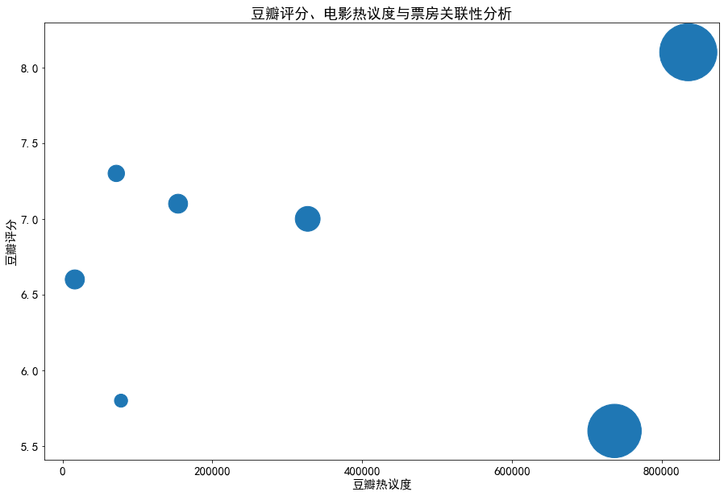

```python
import pandas as pd
import numpy as np

movie_info = pd.read_csv("movie_info.csv")
movie_info.head()
```


<div>
<style scoped>
    .dataframe tbody tr th:only-of-type {
        vertical-align: middle;
    }

    .dataframe tbody tr th {
        vertical-align: top;
    }
    
    .dataframe thead th {
        text-align: right;
    }
</style>
<table border="1" class="dataframe">
  <thead>
    <tr style="text-align: right;">
      <th></th>
      <th>movie_id</th>
      <th>movie_name</th>
      <th>movie_year</th>
      <th>movie_info</th>
      <th>rating_num</th>
      <th>rating</th>
      <th>rating_sum</th>
      <th>rating_info</th>
    </tr>
  </thead>
  <tbody>
    <tr>
      <th>0</th>
      <td>34841067</td>
      <td>你好，李焕英</td>
      <td>2021</td>
      <td>导演:贾玲编剧:贾玲/孙集斌/王宇/刘宏禄/卜钰/郭宇鹏主演:贾玲/张小斐/沈腾/陈赫/刘佳...</td>
      <td>8.1</td>
      <td>4.0</td>
      <td>835297</td>
      <td>5星29.8%4星46.9%3星20.6%2星2.2%1星0.6%</td>
    </tr>
    <tr>
      <th>1</th>
      <td>27619748</td>
      <td>唐人街探案3</td>
      <td>2021</td>
      <td>导演:陈思诚编剧:陈思诚/张淳/刘吾驷/莲舟/严以宁主演:王宝强/刘昊然/妻夫木聪/托尼·贾...</td>
      <td>5.6</td>
      <td>3.0</td>
      <td>736832</td>
      <td>5星4.3%4星16.8%3星44.5%2星24.6%1星9.8%</td>
    </tr>
    <tr>
      <th>2</th>
      <td>26826330</td>
      <td>刺杀小说家</td>
      <td>2021</td>
      <td>导演:路阳编剧:陈舒/禹扬/秦海燕/路阳主演:雷佳音/杨幂/董子健/于和伟/郭京飞/佟丽娅/...</td>
      <td>7.0</td>
      <td>3.5</td>
      <td>327218</td>
      <td>5星10.5%4星41.7%3星37.3%2星8.4%1星2.2%</td>
    </tr>
    <tr>
      <th>3</th>
      <td>34880302</td>
      <td>人潮汹涌</td>
      <td>2021</td>
      <td>导演:饶晓志编剧:饶晓志/范翔/李想主演:刘德华/肖央/万茜/程怡/黄小蕾/国义骞/狄志杰/...</td>
      <td>7.1</td>
      <td>3.5</td>
      <td>154197</td>
      <td>5星11.9%4星41.9%3星37.1%2星7.8%1星1.3%</td>
    </tr>
    <tr>
      <th>4</th>
      <td>34779692</td>
      <td>新神榜：哪吒重生</td>
      <td>2021</td>
      <td>导演:赵霁编剧:沐川主演:杨天翔/张赫/宣晓鸣/李诗萌/朱可儿/凌振赫/刘若班/张遥函/张喆...</td>
      <td>7.3</td>
      <td>3.5</td>
      <td>71704</td>
      <td>5星16.8%4星42.3%3星32.4%2星7.1%1星1.4%</td>
    </tr>
  </tbody>
</table>
</div>


```python
movie_info.shape
```


    (7, 8)


```python
movie_info.info()
```

    <class 'pandas.core.frame.DataFrame'>
    RangeIndex: 7 entries, 0 to 6
    Data columns (total 8 columns):
     #   Column       Non-Null Count  Dtype  
    ---  ------       --------------  -----  
     0   movie_id     7 non-null      int64  
     1   movie_name   7 non-null      object 
     2   movie_year   7 non-null      int64  
     3   movie_info   7 non-null      object 
     4   rating_num   7 non-null      float64
     5   rating       7 non-null      float64
     6   rating_sum   7 non-null      int64  
     7   rating_info  7 non-null      object 
    dtypes: float64(2), int64(3), object(3)
    memory usage: 576.0+ bytes


## 春节档电影豆瓣评分，综合票房数据可视化
春节档电影如下：
- 你好，李焕英
- 唐人街探案3
- 刺杀小说家
- 人潮汹涌
- 新神榜：哪吒重生
- 侍神令
- 熊出没·狂野大陆


```python
from pyecharts import options as opts
from pyecharts.charts import Bar
from pyecharts import options as opts
```


```python
ranting_num_df = movie_info.sort_values(by='rating_num')
```

## 春节档电影豆瓣评分排名


```python
c = (
    Bar(init_opts=opts.InitOpts(width='1100px'))
    .add_xaxis(list(ranting_num_df['movie_name']))
    .add_yaxis("豆瓣评分", list(ranting_num_df['rating_num']))
    .set_global_opts(
        title_opts=opts.TitleOpts(title="春节档电影豆瓣评分排名"),
        yaxis_opts=opts.AxisOpts(name="电影名称"),
        xaxis_opts=opts.AxisOpts(name="评分/10"),
        legend_opts=opts.LegendOpts(is_show=False),
    )
    .reversal_axis()
    .set_series_opts(label_opts=opts.LabelOpts(position="right"))
    .render("春节档电影豆瓣评分排名.html")
)
#c.render_notebook()
```


## 春节档电影总票房排名

数据来自猫眼电影实时票房


```python
piaofang = pd.read_csv('maoyan.csv')
piaofang.head()
```


<div>
<style scoped>
    .dataframe tbody tr th:only-of-type {
        vertical-align: middle;
    }

    .dataframe tbody tr th {
        vertical-align: top;
    }
    
    .dataframe thead th {
        text-align: right;
    }
</style>
<table border="1" class="dataframe">
  <thead>
    <tr style="text-align: right;">
      <th></th>
      <th>movie_id</th>
      <th>movie_name</th>
      <th>sum_box_desc</th>
      <th>box_desc</th>
      <th>box_rate</th>
      <th>show_count_rate</th>
      <th>seat_count_rate</th>
    </tr>
  </thead>
  <tbody>
    <tr>
      <th>0</th>
      <td>1299372</td>
      <td>你好，李焕英</td>
      <td>50.41亿</td>
      <td>6397.48</td>
      <td>36.0%</td>
      <td>28.9%</td>
      <td>35.6%</td>
    </tr>
    <tr>
      <th>1</th>
      <td>1300936</td>
      <td>人潮汹涌</td>
      <td>5.58亿</td>
      <td>2880.32</td>
      <td>16.2%</td>
      <td>15.1%</td>
      <td>13.9%</td>
    </tr>
    <tr>
      <th>2</th>
      <td>894008</td>
      <td>寻龙传说</td>
      <td>3372.5万</td>
      <td>2470.68</td>
      <td>13.9%</td>
      <td>16.0%</td>
      <td>17.3%</td>
    </tr>
    <tr>
      <th>3</th>
      <td>1217023</td>
      <td>唐人街探案3</td>
      <td>44.04亿</td>
      <td>2285.49</td>
      <td>12.8%</td>
      <td>14.0%</td>
      <td>12.3%</td>
    </tr>
    <tr>
      <th>4</th>
      <td>1048268</td>
      <td>刺杀小说家</td>
      <td>9.53亿</td>
      <td>1611.41</td>
      <td>9.0%</td>
      <td>9.2%</td>
      <td>7.9%</td>
    </tr>
  </tbody>
</table>
</div>


```python
sum_box_desc = []
for name in list(ranting_num_df['movie_name']):
    sum_box_desc = sum_box_desc + list(piaofang[piaofang['movie_name'] == name]['sum_box_desc'])
    
piaofang_dict = { 'movie_name': list(ranting_num_df['movie_name']),
                  'sum_box_desc': sum_box_desc}
piaofang = pd.DataFrame(piaofang_dict)
sum_box_desc_float = []
for i in piaofang['sum_box_desc'].values:
    sum_box_desc_float.append(i.replace('亿', ''))
piaofang['sum_box_desc_float'] = sum_box_desc_float
piaofang['sum_box_desc_float'] = piaofang['sum_box_desc_float'].astype(float)
```


```python
piaofang = piaofang.sort_values(by='sum_box_desc_float')
piaofang
```


<div>
<style scoped>
    .dataframe tbody tr th:only-of-type {
        vertical-align: middle;
    }

    .dataframe tbody tr th {
        vertical-align: top;
    }
    
    .dataframe thead th {
        text-align: right;
    }
</style>
<table border="1" class="dataframe">
  <thead>
    <tr style="text-align: right;">
      <th></th>
      <th>movie_name</th>
      <th>sum_box_desc</th>
      <th>sum_box_desc_float</th>
    </tr>
  </thead>
  <tbody>
    <tr>
      <th>1</th>
      <td>侍神令</td>
      <td>2.65亿</td>
      <td>2.65</td>
    </tr>
    <tr>
      <th>5</th>
      <td>新神榜：哪吒重生</td>
      <td>4.18亿</td>
      <td>4.18</td>
    </tr>
    <tr>
      <th>4</th>
      <td>人潮汹涌</td>
      <td>5.58亿</td>
      <td>5.58</td>
    </tr>
    <tr>
      <th>2</th>
      <td>熊出没·狂野大陆</td>
      <td>5.69亿</td>
      <td>5.69</td>
    </tr>
    <tr>
      <th>3</th>
      <td>刺杀小说家</td>
      <td>9.53亿</td>
      <td>9.53</td>
    </tr>
    <tr>
      <th>0</th>
      <td>唐人街探案3</td>
      <td>44.04亿</td>
      <td>44.04</td>
    </tr>
    <tr>
      <th>6</th>
      <td>你好，李焕英</td>
      <td>50.41亿</td>
      <td>50.41</td>
    </tr>
  </tbody>
</table>
</div>


```python
c = (
    Bar(init_opts=opts.InitOpts(width='1100px'))
    .add_xaxis(list(piaofang['movie_name']))
    .add_yaxis("综合票房", list(piaofang['sum_box_desc_float']))
    .set_global_opts(
        title_opts=opts.TitleOpts(title="春节档电影总票房排名"),
        yaxis_opts=opts.AxisOpts(name="电影名称"),
        xaxis_opts=opts.AxisOpts(name="票房/亿"),
        legend_opts=opts.LegendOpts(is_show=False),
    )
    .reversal_axis()
    .set_series_opts(label_opts=opts.LabelOpts(position="right"))
    .render("春节档电影总票房排名.html")
)
#c.render_notebook()
```


分析春节档电影票房排名发现，《你好，李焕英》与《唐人街探案》的总票房数相差不大。

但该两部电影的总票房远远大于剩余五部电影，可见《你好，李焕英》与《唐人街探案》的人气之高。

## 豆瓣评论评分分析

movie id：

你好，李焕英：34841067

唐人街探案3：27619748

刺杀小说家：26826330

人潮汹涌：34880302

新神榜：哪吒重生：34779692

侍神令：26935283

熊出没·狂野大陆：34825886

### 你好，李焕英


```python
comments = pd.read_csv('comment.csv')
comments.head()
```


<div>
<style scoped>
    .dataframe tbody tr th:only-of-type {
        vertical-align: middle;
    }

    .dataframe tbody tr th {
        vertical-align: top;
    }
    
    .dataframe thead th {
        text-align: right;
    }
</style>
<table border="1" class="dataframe">
  <thead>
    <tr style="text-align: right;">
      <th></th>
      <th>movie_id</th>
      <th>user_name</th>
      <th>rating</th>
      <th>comment_time</th>
      <th>comment_info</th>
      <th>votes_num</th>
      <th>user_url</th>
      <th>comment_date</th>
    </tr>
  </thead>
  <tbody>
    <tr>
      <th>0</th>
      <td>34841067</td>
      <td>蛋黄已跑路</td>
      <td>3.0</td>
      <td>2021-02-12 10:39:37</td>
      <td>沈腾的戏份约等于欢乐颂男主，其他不评论</td>
      <td>10398</td>
      <td>https://www.douban.com/people/157383058/</td>
      <td>2021-02-12</td>
    </tr>
    <tr>
      <th>1</th>
      <td>34841067</td>
      <td>大隐隐于没注销</td>
      <td>NaN</td>
      <td>2021-02-12 13:00:53</td>
      <td>这次感受注定是感性压倒理性的，所以就不打分了。\n贾玲还是适合做小品，她的表演方式、她的叙事...</td>
      <td>11774</td>
      <td>https://www.douban.com/people/momopeach/</td>
      <td>2021-02-12</td>
    </tr>
    <tr>
      <th>2</th>
      <td>34841067</td>
      <td>韦斯安徒生</td>
      <td>3.0</td>
      <td>2021-02-12 11:20:22</td>
      <td>贾玲水平有限，奈何感情无比真挚。虽然结尾让我哭的稀里哗啦，但也没能改变前半段就是个低配版夏洛...</td>
      <td>4055</td>
      <td>https://www.douban.com/people/80797429/</td>
      <td>2021-02-12</td>
    </tr>
    <tr>
      <th>3</th>
      <td>34841067</td>
      <td>Augenstern</td>
      <td>5.0</td>
      <td>2021-02-12 10:10:39</td>
      <td>贾玲：我给你们讲个笑话，你们别哭。</td>
      <td>22777</td>
      <td>https://www.douban.com/people/domisodagreen/</td>
      <td>2021-02-12</td>
    </tr>
    <tr>
      <th>4</th>
      <td>34841067</td>
      <td>Raremore</td>
      <td>5.0</td>
      <td>2021-02-12 17:09:11</td>
      <td>“我宝”那句出来的时候真的直接泪奔\n我以为只有我回到了1981,我以为我可以牺牲我自己改变...</td>
      <td>18743</td>
      <td>https://www.douban.com/people/205525018/</td>
      <td>2021-02-12</td>
    </tr>
  </tbody>
</table>
</div>


```python
comments.info()
```

    <class 'pandas.core.frame.DataFrame'>
    RangeIndex: 3500 entries, 0 to 3499
    Data columns (total 8 columns):
     #   Column        Non-Null Count  Dtype  
    ---  ------        --------------  -----  
     0   movie_id      3500 non-null   int64  
     1   user_name     3500 non-null   object 
     2   rating        3454 non-null   float64
     3   comment_time  3500 non-null   object 
     4   comment_info  3500 non-null   object 
     5   votes_num     3500 non-null   int64  
     6   user_url      3500 non-null   object 
     7   comment_date  3500 non-null   object 
    dtypes: float64(1), int64(2), object(5)
    memory usage: 218.9+ KB


```python
lhy = comments[comments['movie_id'] == 34841067]
lhy.dropna().groupby('rating').count()['movie_id']
```


    rating
    1.0     32
    2.0     60
    3.0     83
    4.0    130
    5.0    191
    Name: movie_id, dtype: int64


```python
from pyecharts import options as opts
from pyecharts.charts import Pie

c = (
    Pie()
    .add(
        "豆瓣评论评分",
        [list(z) for z in zip(['1星','2星','3星','4星','5星'], list(lhy.dropna().groupby('rating').count()['movie_id']))],
        center=["35%", "50%"],
    )
    .set_global_opts(
        title_opts=opts.TitleOpts(title="豆瓣评论评分分布", subtitle="《你好，李焕英》"),
    )
    .set_series_opts(label_opts=opts.LabelOpts(formatter="{b}: {d}%"))
    .render("豆瓣评论评分分布-lhy.html")
)
#c.render_notebook()
```


### 唐人街探案3


```python
trj = comments[comments['movie_id'] == 27619748]
trj.dropna().groupby('rating').count()['movie_id']
```


    rating
    1.0    219
    2.0    144
    3.0     62
    4.0     35
    5.0     40
    Name: movie_id, dtype: int64


```python
from pyecharts import options as opts
from pyecharts.charts import Pie

c = (
    Pie()
    .add(
        "豆瓣评论评分",
        [list(z) for z in zip(['1星','2星','3星','4星','5星'], list(trj.dropna().groupby('rating').count()['movie_id']))],
        center=["35%", "50%"],
    )
    .set_global_opts(
        title_opts=opts.TitleOpts(title="豆瓣评论评分分布", subtitle="《唐人街探案3》"),
    )
    .set_series_opts(label_opts=opts.LabelOpts(formatter="{b}: {d}%"))
    .render("豆瓣评论评分分布-trj.html")
)
#c.render_notebook()
```


### 刺杀小说家


```python
csxsj = comments[comments['movie_id'] == 26826330]
csxsj.dropna().groupby('rating').count()['movie_id']
```


    rating
    1.0     43
    2.0     36
    3.0     25
    4.0    168
    5.0    227
    Name: movie_id, dtype: int64


```python
from pyecharts import options as opts
from pyecharts.charts import Pie

c = (
    Pie()
    .add(
        "豆瓣评论评分",
        [list(z) for z in zip(['1星','2星','3星','4星','5星'], list(csxsj.dropna().groupby('rating').count()['movie_id']))],
        center=["35%", "50%"],
    )
    .set_global_opts(
        title_opts=opts.TitleOpts(title="豆瓣评论评分分布", subtitle="《刺杀小说家》"),
    )
    .set_series_opts(label_opts=opts.LabelOpts(formatter="{b}: {d}%"))
    .render("豆瓣评论评分分布-csxsj.html")
)
#c.render_notebook()
```


### 人潮汹涌


```python
rcxy = comments[comments['movie_id'] == 34880302]
rcxy.dropna().groupby('rating').count()['movie_id']
```


    rating
    1.0     28
    2.0     76
    3.0    132
    4.0    182
    5.0     78
    Name: movie_id, dtype: int64


```python
from pyecharts import options as opts
from pyecharts.charts import Pie

c = (
    Pie()
    .add(
        "豆瓣评论评分",
        [list(z) for z in zip(['1星','2星','3星','4星','5星'], list(rcxy.dropna().groupby('rating').count()['movie_id']))],
        center=["35%", "50%"],
    )
    .set_global_opts(
        title_opts=opts.TitleOpts(title="豆瓣评论评分分布", subtitle="《人潮汹涌》"),
    )
    .set_series_opts(label_opts=opts.LabelOpts(formatter="{b}: {d}%"))
    .render("豆瓣评论评分分布-rcxr.html")
)
#c.render_notebook()
```


### 新神榜：哪吒重生


```python
nzcs = comments[comments['movie_id'] == 34779692]
nzcs.dropna().groupby('rating').count()['movie_id']
```


    rating
    1.0     40
    2.0     77
    3.0    151
    4.0    154
    5.0     64
    Name: movie_id, dtype: int64


```python
from pyecharts import options as opts
from pyecharts.charts import Pie

c = (
    Pie()
    .add(
        "豆瓣评论评分",
        [list(z) for z in zip(['1星','2星','3星','4星','5星'], list(nzcs.dropna().groupby('rating').count()['movie_id']))],
        center=["35%", "50%"],
    )
    .set_global_opts(
        title_opts=opts.TitleOpts(title="豆瓣评论评分分布", subtitle="《新神榜：哪吒重生》"),
    )
    .set_series_opts(label_opts=opts.LabelOpts(formatter="{b}: {d}%"))
    .render("豆瓣评论评分分布-nzcs.html")
)
#c.render_notebook()
```


### 侍神令


```python
ssl = comments[comments['movie_id'] == 26935283]
ssl.dropna().groupby('rating').count()['movie_id']
```


    rating
    1.0    148
    2.0    163
    3.0     62
    4.0     86
    5.0     35
    Name: movie_id, dtype: int64


```python
from pyecharts import options as opts
from pyecharts.charts import Pie

c = (
    Pie()
    .add(
        "豆瓣评论评分",
        [list(z) for z in zip(['1星','2星','3星','4星','5星'], list(ssl.dropna().groupby('rating').count()['movie_id']))],
        center=["35%", "50%"],
    )
    .set_global_opts(
        title_opts=opts.TitleOpts(title="豆瓣评论评分分布", subtitle="《侍神令》"),
    )
    .set_series_opts(label_opts=opts.LabelOpts(formatter="{b}: {d}%"))
    .render("豆瓣评论评分分布-ssl.html")
)
#c.render_notebook()
```


### 熊出没·狂野大陆


```python
xcm = comments[comments['movie_id'] == 34825886]
xcm.dropna().groupby('rating').count()['movie_id']
```


    rating
    1.0     14
    2.0     46
    3.0    204
    4.0    149
    5.0     70
    Name: movie_id, dtype: int64


```python
from pyecharts import options as opts
from pyecharts.charts import Pie

c = (
    Pie()
    .add(
        "豆瓣评论评分",
        [list(z) for z in zip(['1星','2星','3星','4星','5星'], list(xcm.dropna().groupby('rating').count()['movie_id']))],
        center=["35%", "50%"],
    )
    .set_global_opts(
        title_opts=opts.TitleOpts(title="豆瓣评论评分分布", subtitle="《熊出没·狂野大陆》"),
    )
    .set_series_opts(label_opts=opts.LabelOpts(formatter="{b}: {d}%"))
    .render("豆瓣评论评分分布-xcm.html")
)
#c.render_notebook()
```


### 各电影豆瓣评论评分数据整合

你好，李焕英：34841067

唐人街探案3：27619748

刺杀小说家：26826330

人潮汹涌：34880302

新神榜：哪吒重生：34779692

侍神令：26935283

熊出没·狂野大陆：34825886


```python
# 整合电影名称
movie_name = ['你好，李焕英', '唐人街探案3', '刺杀小说家', '人潮汹涌', '新神榜：哪吒重生', '侍神令', '熊出没·狂野大陆']
# 整合各电影评论评分数据
rating_one = []
rating_two = []
rating_three = []
rating_four = []
rating_five = []
movie_id_list = [34841067, 27619748, 26826330, 34880302, 34779692, 26935283, 34825886]
comments[comments['movie_id'] == 34825886]
for movie_id in movie_id_list:
    rating_list = list(comments[comments['movie_id'] == movie_id].dropna().groupby('rating').count()['movie_id'])
    rating_one.append(rating_list[0])
    rating_two.append(rating_list[1])
    rating_three.append(rating_list[2])
    rating_four.append(rating_list[3])
    rating_five.append(rating_list[4])
```


```python
from pyecharts import options as opts
from pyecharts.charts import Bar

c = (
    Bar(init_opts=opts.InitOpts(width='1100px'))
    .add_xaxis(movie_name)
    .add_yaxis("1星", rating_one, stack="stack1")
    .add_yaxis("2星", rating_two, stack="stack1")
    .add_yaxis("3星", rating_three, stack="stack1")
    .add_yaxis("4星", rating_four, stack="stack1")
    .add_yaxis("5星", rating_five, stack="stack1")
    .set_series_opts(label_opts=opts.LabelOpts(is_show=False))
    .set_global_opts(
        title_opts=opts.TitleOpts(title="各电影豆瓣评论评分分布"),
        xaxis_opts=opts.AxisOpts(name="电影名称"),
        yaxis_opts=opts.AxisOpts(name="对应评分人数"),
    )
    .set_series_opts(
        label_opts=opts.LabelOpts(formatter="{c}", position="inside", color="white")
    )
    .render("各电影豆瓣评论评分分布.html")
)
#c.render_notebook()
```


## 票房分析

### 豆瓣评分、电影热议度与票房关联性分析
电影热议度：豆瓣评价人数


```python
from pyecharts import options as opts
from pyecharts.charts import Scatter
import seaborn as sns
import matplotlib.pyplot as plt
```


```python
movie_info['rating_sum']
```


    0    835297
    1    736832
    2    327218
    3    154197
    4     71704
    5     78015
    6     16338
    Name: rating_sum, dtype: int64


```python
movie_info
```


<div>
<style scoped>
    .dataframe tbody tr th:only-of-type {
        vertical-align: middle;
    }

    .dataframe tbody tr th {
        vertical-align: top;
    }
    
    .dataframe thead th {
        text-align: right;
    }
</style>
<table border="1" class="dataframe">
  <thead>
    <tr style="text-align: right;">
      <th></th>
      <th>movie_id</th>
      <th>movie_name</th>
      <th>movie_year</th>
      <th>movie_info</th>
      <th>rating_num</th>
      <th>rating</th>
      <th>rating_sum</th>
      <th>rating_info</th>
    </tr>
  </thead>
  <tbody>
    <tr>
      <th>0</th>
      <td>34841067</td>
      <td>你好，李焕英</td>
      <td>2021</td>
      <td>导演:贾玲编剧:贾玲/孙集斌/王宇/刘宏禄/卜钰/郭宇鹏主演:贾玲/张小斐/沈腾/陈赫/刘佳...</td>
      <td>8.1</td>
      <td>4.0</td>
      <td>835297</td>
      <td>5星29.8%4星46.9%3星20.6%2星2.2%1星0.6%</td>
    </tr>
    <tr>
      <th>1</th>
      <td>27619748</td>
      <td>唐人街探案3</td>
      <td>2021</td>
      <td>导演:陈思诚编剧:陈思诚/张淳/刘吾驷/莲舟/严以宁主演:王宝强/刘昊然/妻夫木聪/托尼·贾...</td>
      <td>5.6</td>
      <td>3.0</td>
      <td>736832</td>
      <td>5星4.3%4星16.8%3星44.5%2星24.6%1星9.8%</td>
    </tr>
    <tr>
      <th>2</th>
      <td>26826330</td>
      <td>刺杀小说家</td>
      <td>2021</td>
      <td>导演:路阳编剧:陈舒/禹扬/秦海燕/路阳主演:雷佳音/杨幂/董子健/于和伟/郭京飞/佟丽娅/...</td>
      <td>7.0</td>
      <td>3.5</td>
      <td>327218</td>
      <td>5星10.5%4星41.7%3星37.3%2星8.4%1星2.2%</td>
    </tr>
    <tr>
      <th>3</th>
      <td>34880302</td>
      <td>人潮汹涌</td>
      <td>2021</td>
      <td>导演:饶晓志编剧:饶晓志/范翔/李想主演:刘德华/肖央/万茜/程怡/黄小蕾/国义骞/狄志杰/...</td>
      <td>7.1</td>
      <td>3.5</td>
      <td>154197</td>
      <td>5星11.9%4星41.9%3星37.1%2星7.8%1星1.3%</td>
    </tr>
    <tr>
      <th>4</th>
      <td>34779692</td>
      <td>新神榜：哪吒重生</td>
      <td>2021</td>
      <td>导演:赵霁编剧:沐川主演:杨天翔/张赫/宣晓鸣/李诗萌/朱可儿/凌振赫/刘若班/张遥函/张喆...</td>
      <td>7.3</td>
      <td>3.5</td>
      <td>71704</td>
      <td>5星16.8%4星42.3%3星32.4%2星7.1%1星1.4%</td>
    </tr>
    <tr>
      <th>5</th>
      <td>26935283</td>
      <td>侍神令</td>
      <td>2021</td>
      <td>导演:李蔚然编剧:张家鲁/翦以玟主演:陈坤/周迅/陈伟霆/屈楚萧/王丽坤/沈月/王紫璇/王悦...</td>
      <td>5.8</td>
      <td>3.0</td>
      <td>78015</td>
      <td>5星5.0%4星19.0%3星45.8%2星23.9%1星6.4%</td>
    </tr>
    <tr>
      <th>6</th>
      <td>34825886</td>
      <td>熊出没·狂野大陆</td>
      <td>2020</td>
      <td>导演:丁亮/邵和麒编剧:徐芸/崔铁志/张宇主演:张伟/张秉君/谭笑类型:喜剧/科幻/动画制片...</td>
      <td>6.6</td>
      <td>3.5</td>
      <td>16338</td>
      <td>5星7.6%4星29.6%3星50.4%2星10.9%1星1.6%</td>
    </tr>
  </tbody>
</table>
</div>


```python
piaofang_sum = []
for name in movie_info['movie_name'].tolist():
    piaofang_sum = piaofang_sum + list(piaofang[piaofang['movie_name'] == name]['sum_box_desc_float'])
for i in range(len(piaofang_sum)):
    piaofang_sum[i] = piaofang_sum[i] * 100
piaofang_sum
```


    [5041.0, 4404.0, 952.9999999999999, 558.0, 418.0, 265.0, 569.0]


```python
# 去除警告日志提醒的显示
from pandas.plotting import register_matplotlib_converters
register_matplotlib_converters()

font = {
    "family":"SimHei",
    "size":"15"
}
plt.rc("font",**font)

plt.figure(figsize=(15,10))
plt.scatter(movie_info['rating_sum'], movie_info['rating_num'] ,s=piaofang_sum, marker="o")
plt.xlabel('豆瓣热议度')
plt.ylabel('豆瓣评分')
plt.title('豆瓣评分、电影热议度与票房关联性分析')

plt.show()
```





- 气泡为总票房，气泡越大票房越高

由图中可知电影热议度与票房存在一定关联度，热议度越高的电影票房也就越高。

豆瓣评分与票房关联度不明显，评分高的影片不一定会收获更高的票房。

### 票房与热议度分析


```python
pccs = np.corrcoef(movie_info['rating_sum'], piaofang_sum)
pccs
```


    array([[1.        , 0.97514093],
           [0.97514093, 1.        ]])


根据计算所得皮尔逊相关系数=0.98，说明电影票房与热议度存在高度相关性。

## 豆瓣评论数据分析
通过爬虫获取春节档电影500条豆瓣评论


```python
comments
```


<div>
<style scoped>
    .dataframe tbody tr th:only-of-type {
        vertical-align: middle;
    }

    .dataframe tbody tr th {
        vertical-align: top;
    }
    
    .dataframe thead th {
        text-align: right;
    }
</style>
<table border="1" class="dataframe">
  <thead>
    <tr style="text-align: right;">
      <th></th>
      <th>movie_id</th>
      <th>user_name</th>
      <th>rating</th>
      <th>comment_time</th>
      <th>comment_info</th>
      <th>votes_num</th>
      <th>user_url</th>
      <th>comment_date</th>
    </tr>
  </thead>
  <tbody>
    <tr>
      <th>0</th>
      <td>34841067</td>
      <td>蛋黄已跑路</td>
      <td>3.0</td>
      <td>2021-02-12 10:39:37</td>
      <td>沈腾的戏份约等于欢乐颂男主，其他不评论</td>
      <td>10398</td>
      <td>https://www.douban.com/people/157383058/</td>
      <td>2021-02-12</td>
    </tr>
    <tr>
      <th>1</th>
      <td>34841067</td>
      <td>大隐隐于没注销</td>
      <td>NaN</td>
      <td>2021-02-12 13:00:53</td>
      <td>这次感受注定是感性压倒理性的，所以就不打分了。\n贾玲还是适合做小品，她的表演方式、她的叙事...</td>
      <td>11774</td>
      <td>https://www.douban.com/people/momopeach/</td>
      <td>2021-02-12</td>
    </tr>
    <tr>
      <th>2</th>
      <td>34841067</td>
      <td>韦斯安徒生</td>
      <td>3.0</td>
      <td>2021-02-12 11:20:22</td>
      <td>贾玲水平有限，奈何感情无比真挚。虽然结尾让我哭的稀里哗啦，但也没能改变前半段就是个低配版夏洛...</td>
      <td>4055</td>
      <td>https://www.douban.com/people/80797429/</td>
      <td>2021-02-12</td>
    </tr>
    <tr>
      <th>3</th>
      <td>34841067</td>
      <td>Augenstern</td>
      <td>5.0</td>
      <td>2021-02-12 10:10:39</td>
      <td>贾玲：我给你们讲个笑话，你们别哭。</td>
      <td>22777</td>
      <td>https://www.douban.com/people/domisodagreen/</td>
      <td>2021-02-12</td>
    </tr>
    <tr>
      <th>4</th>
      <td>34841067</td>
      <td>Raremore</td>
      <td>5.0</td>
      <td>2021-02-12 17:09:11</td>
      <td>“我宝”那句出来的时候真的直接泪奔\n我以为只有我回到了1981,我以为我可以牺牲我自己改变...</td>
      <td>18743</td>
      <td>https://www.douban.com/people/205525018/</td>
      <td>2021-02-12</td>
    </tr>
    <tr>
      <th>...</th>
      <td>...</td>
      <td>...</td>
      <td>...</td>
      <td>...</td>
      <td>...</td>
      <td>...</td>
      <td>...</td>
      <td>...</td>
    </tr>
    <tr>
      <th>3495</th>
      <td>34825886</td>
      <td>Neo</td>
      <td>4.0</td>
      <td>2021-02-21 16:20:56</td>
      <td>超出期待 三点六分，四舍五入四分</td>
      <td>0</td>
      <td>https://www.douban.com/people/4087576/</td>
      <td>2021-02-21</td>
    </tr>
    <tr>
      <th>3496</th>
      <td>34825886</td>
      <td>James</td>
      <td>3.0</td>
      <td>2021-02-20 13:04:24</td>
      <td>陪闺女看的，嘻嘻嘻，哈哈哈哈，看着玩还可以，小朋友很喜欢</td>
      <td>0</td>
      <td>https://www.douban.com/people/56219178/</td>
      <td>2021-02-20</td>
    </tr>
    <tr>
      <th>3497</th>
      <td>34825886</td>
      <td>海绵宝宝</td>
      <td>4.0</td>
      <td>2021-02-14 21:00:03</td>
      <td>今天一整天的票都售空了，只剩熊出没一排一座。好看。</td>
      <td>0</td>
      <td>https://www.douban.com/people/haimianbao123/</td>
      <td>2021-02-14</td>
    </tr>
    <tr>
      <th>3498</th>
      <td>34825886</td>
      <td>啊逗</td>
      <td>4.0</td>
      <td>2021-02-12 13:11:48</td>
      <td>小孩子的电影，陪看的，主角很开心。前几部剧场版我也都没看过，比剧集节奏还是好一些，没有太多的...</td>
      <td>0</td>
      <td>https://www.douban.com/people/177602573/</td>
      <td>2021-02-12</td>
    </tr>
    <tr>
      <th>3499</th>
      <td>34825886</td>
      <td>白</td>
      <td>4.0</td>
      <td>2021-02-20 21:10:50</td>
      <td>挺有趣的！</td>
      <td>0</td>
      <td>https://www.douban.com/people/46232830/</td>
      <td>2021-02-20</td>
    </tr>
  </tbody>
</table>
<p>3500 rows × 8 columns</p>
</div>


```python
comments['comment_time'] = pd.to_datetime(comments['comment_time'])
comments['comment_date'] = pd.to_datetime(comments['comment_date'])
comments.info()
```

    <class 'pandas.core.frame.DataFrame'>
    RangeIndex: 3500 entries, 0 to 3499
    Data columns (total 8 columns):
     #   Column        Non-Null Count  Dtype         
    ---  ------        --------------  -----         
     0   movie_id      3500 non-null   int64         
     1   user_name     3500 non-null   object        
     2   rating        3454 non-null   float64       
     3   comment_time  3500 non-null   datetime64[ns]
     4   comment_info  3500 non-null   object        
     5   votes_num     3500 non-null   int64         
     6   user_url      3500 non-null   object        
     7   comment_date  3500 non-null   datetime64[ns]
    dtypes: datetime64[ns](2), float64(1), int64(2), object(3)
    memory usage: 218.9+ KB


你好，李焕英：34841067

唐人街探案3：27619748

刺杀小说家：26826330

人潮汹涌：34880302

新神榜：哪吒重生：34779692

侍神令：26935283

熊出没·狂野大陆：34825886

### 日评论数量趋势分析


```python
lhy = comments[comments['movie_id'] == 34841067].groupby('comment_date').count()
trj = comments[comments['movie_id'] == 27619748].groupby('comment_date').count()
csxsj = comments[comments['movie_id'] == 26826330].groupby('comment_date').count()
rcxr = comments[comments['movie_id'] == 34880302].groupby('comment_date').count()
nzcs = comments[comments['movie_id'] == 34779692].groupby('comment_date').count()
ssl = comments[comments['movie_id'] == 26935283].groupby('comment_date').count()
xcm = comments[comments['movie_id'] == 34825886].groupby('comment_date').count()
```


```python
from datetime import datetime

lhy_index = lhy.index
lhy_index = pd.DataFrame(lhy_index)
lhy_index['comment_date']= lhy_index['comment_date'].apply(lambda x: datetime.strftime(x,'%Y-%m-%d'))
```


```python
trj_index = trj.index
trj_index = pd.DataFrame(trj_index)
trj_index['comment_date']= trj_index['comment_date'].apply(lambda x: datetime.strftime(x,'%Y-%m-%d'))
```


```python
csxsj_index = csxsj.index
csxsj_index = pd.DataFrame(csxsj_index)
csxsj_index['comment_date']= csxsj_index['comment_date'].apply(lambda x: datetime.strftime(x,'%Y-%m-%d'))
```


```python
rcxr_index = rcxr.index
rcxr_index = pd.DataFrame(rcxr_index)
rcxr_index['comment_date']= rcxr_index['comment_date'].apply(lambda x: datetime.strftime(x,'%Y-%m-%d'))
```


```python
nzcs_index = nzcs.index
nzcs_index = pd.DataFrame(nzcs_index)
nzcs_index['comment_date']= nzcs_index['comment_date'].apply(lambda x: datetime.strftime(x,'%Y-%m-%d'))
```


```python
ssl_index = ssl.index
ssl_index = pd.DataFrame(ssl_index)
ssl_index['comment_date']= ssl_index['comment_date'].apply(lambda x: datetime.strftime(x,'%Y-%m-%d'))
```


```python
xcm_index = xcm.index
xcm_index = pd.DataFrame(xcm_index)
xcm_index['comment_date']= xcm_index['comment_date'].apply(lambda x: datetime.strftime(x,'%Y-%m-%d'))
```


```python
import pyecharts.options as opts
from pyecharts.charts import Line


c1 = (
    Line(init_opts=opts.InitOpts(width='1100px'))
    .add_xaxis(lhy_index['comment_date'].tolist())
    .add_yaxis(
        series_name="你好，李焕英",
        stack="评论数1",
        y_axis=lhy['movie_id'].tolist(),
        label_opts=opts.LabelOpts(is_show=False),
    )
)
c2 = (
    Line(init_opts=opts.InitOpts(width='1100px'))
    .add_xaxis(trj_index['comment_date'].tolist())
    .add_yaxis(
        series_name="唐人街探案3",
        stack="评论数2",
        y_axis=trj['movie_id'].tolist(),
        label_opts=opts.LabelOpts(is_show=False),
    )
)
c3 = (
    Line(init_opts=opts.InitOpts(width='1100px'))
    .add_xaxis(csxsj_index['comment_date'].tolist())
    .add_yaxis(
        series_name="刺杀小说家",
        stack="评论数3",
        y_axis=csxsj['movie_id'].tolist(),
        label_opts=opts.LabelOpts(is_show=False),
    )
)
c4 = (
    Line(init_opts=opts.InitOpts(width='1100px'))
    .add_xaxis(rcxr_index['comment_date'].tolist())
    .add_yaxis(
        series_name="人潮汹涌",
        stack="评论数4",
        y_axis=rcxr['movie_id'].tolist(),
        label_opts=opts.LabelOpts(is_show=False),
    )
)
c5 = (
    Line(init_opts=opts.InitOpts(width='1100px'))
    .add_xaxis(nzcs_index['comment_date'].tolist())
    .add_yaxis(
        series_name="新神榜：哪吒重生",
        stack="评论数5",
        y_axis=nzcs['movie_id'].tolist(),
        label_opts=opts.LabelOpts(is_show=False),
    )
)
c6 = (
    Line(init_opts=opts.InitOpts(width='1100px'))
    .add_xaxis(ssl_index['comment_date'].tolist())
    .add_yaxis(
        series_name="侍神令",
        stack="评论数6",
        y_axis=ssl['movie_id'].tolist(),
        label_opts=opts.LabelOpts(is_show=False),
    )
)
c7 = (
    Line(init_opts=opts.InitOpts(width='1100px'))
    .add_xaxis(xcm_index['comment_date'].tolist())
    .add_yaxis(
        series_name="熊出没·狂野大陆",
        stack="评论数7",
        y_axis=xcm['movie_id'].tolist(),
        label_opts=opts.LabelOpts(is_show=False),
    )
     .set_global_opts(
        title_opts=opts.TitleOpts(title="日评论数量趋势"),
        tooltip_opts=opts.TooltipOpts(trigger="axis"),
        yaxis_opts=opts.AxisOpts(
            type_="value",
            axistick_opts=opts.AxisTickOpts(is_show=True),
            splitline_opts=opts.SplitLineOpts(is_show=True),
        ),
        xaxis_opts=opts.AxisOpts(type_="category", boundary_gap=False),
    )
)

c7.overlap(c1)
c7.overlap(c2)
c7.overlap(c3)
c7.overlap(c4)
c7.overlap(c5)
c7.overlap(c6)
c7.render("日评论数量趋势.html")
#c7.render_notebook()
```


按照评论日期统计了7部电影3500条评论每天的评论量，发现在2月12日（大年初一）的时候评论数量最多，也是春节档电影上映的第一天。

### 各级评分趋势分析

分析票房较高的两部电影《你好，李焕英》、《唐人街探案3》各级评分趋势分析


```python
lhy = comments[comments['movie_id'] == 34841067]
lhy_1 = lhy[lhy['rating'] == 1].groupby('comment_date').count()
lhy_2 = lhy[lhy['rating'] == 2].groupby('comment_date').count()
lhy_3 = lhy[lhy['rating'] == 3].groupby('comment_date').count()
lhy_4 = lhy[lhy['rating'] == 4].groupby('comment_date').count()
lhy_5 = lhy[lhy['rating'] == 5].groupby('comment_date').count()
```


```python
lhy_1_index = lhy_1.index
lhy_1_index = pd.DataFrame(lhy_1_index)
lhy_1_index['comment_date']= lhy_1_index['comment_date'].apply(lambda x: datetime.strftime(x,'%Y-%m-%d'))

lhy_2_index = lhy_2.index
lhy_2_index = pd.DataFrame(lhy_2_index)
lhy_2_index['comment_date']= lhy_2_index['comment_date'].apply(lambda x: datetime.strftime(x,'%Y-%m-%d'))

lhy_3_index = lhy_3.index
lhy_3_index = pd.DataFrame(lhy_3_index)
lhy_3_index['comment_date']= lhy_3_index['comment_date'].apply(lambda x: datetime.strftime(x,'%Y-%m-%d'))

lhy_4_index = lhy_4.index
lhy_4_index = pd.DataFrame(lhy_4_index)
lhy_4_index['comment_date']= lhy_4_index['comment_date'].apply(lambda x: datetime.strftime(x,'%Y-%m-%d'))

lhy_5_index = lhy_5.index
lhy_5_index = pd.DataFrame(lhy_5_index)
lhy_5_index['comment_date']= lhy_5_index['comment_date'].apply(lambda x: datetime.strftime(x,'%Y-%m-%d'))
```


```python
trj = comments[comments['movie_id'] == 27619748]
trj_1 = trj[trj['rating'] == 1].groupby('comment_date').count()
trj_2 = trj[trj['rating'] == 2].groupby('comment_date').count()
trj_3 = trj[trj['rating'] == 3].groupby('comment_date').count()
trj_4 = trj[trj['rating'] == 4].groupby('comment_date').count()
trj_5 = trj[trj['rating'] == 5].groupby('comment_date').count()
```


```python
trj_1_index = trj_1.index
trj_1_index = pd.DataFrame(trj_1_index)
trj_1_index['comment_date']= trj_1_index['comment_date'].apply(lambda x: datetime.strftime(x,'%Y-%m-%d'))

trj_2_index = trj_2.index
trj_2_index = pd.DataFrame(trj_2_index)
trj_2_index['comment_date']= trj_2_index['comment_date'].apply(lambda x: datetime.strftime(x,'%Y-%m-%d'))

trj_3_index = trj_3.index
trj_3_index = pd.DataFrame(trj_3_index)
trj_3_index['comment_date']= trj_3_index['comment_date'].apply(lambda x: datetime.strftime(x,'%Y-%m-%d'))

trj_4_index = trj_4.index
trj_4_index = pd.DataFrame(trj_4_index)
trj_4_index['comment_date']= trj_4_index['comment_date'].apply(lambda x: datetime.strftime(x,'%Y-%m-%d'))

trj_5_index = trj_5.index
trj_5_index = pd.DataFrame(trj_5_index)
trj_5_index['comment_date']= trj_5_index['comment_date'].apply(lambda x: datetime.strftime(x,'%Y-%m-%d'))
```


```python
import pyecharts.options as opts
from pyecharts.charts import Line


c1 = (
    Line(init_opts=opts.InitOpts(width='1100px'))
    .add_xaxis(lhy_1_index['comment_date'].tolist())
    .add_yaxis(
        series_name="1星",
        stack="评分数1",
        y_axis=lhy_1['movie_id'].tolist(),
        label_opts=opts.LabelOpts(is_show=False),
        is_connect_nones=True
    )
    .set_global_opts(
        title_opts=opts.TitleOpts(title="各级评分趋势-《你好，李焕英》"),
        tooltip_opts=opts.TooltipOpts(trigger="axis"),
        yaxis_opts=opts.AxisOpts(
            type_="value",
            axistick_opts=opts.AxisTickOpts(is_show=True),
            splitline_opts=opts.SplitLineOpts(is_show=True),
        ),
        xaxis_opts=opts.AxisOpts(type_="category", boundary_gap=False),
    )
)
c2 = (
    Line(init_opts=opts.InitOpts(width='1100px'))
    .add_xaxis(lhy_2_index['comment_date'].tolist())
    .add_yaxis(
        series_name="2星",
        stack="评分数2",
        y_axis=lhy_2['movie_id'].tolist(),
        label_opts=opts.LabelOpts(is_show=False),
        is_connect_nones=True
    )
)
c3 = (
    Line(init_opts=opts.InitOpts(width='1100px'))
    .add_xaxis(lhy_3_index['comment_date'].tolist())
    .add_yaxis(
        series_name="3星",
        stack="评分数3",
        y_axis=lhy_3['movie_id'].tolist(),
        label_opts=opts.LabelOpts(is_show=False),
        is_connect_nones=True
    )
)
c4 = (
    Line(init_opts=opts.InitOpts(width='1100px'))
    .add_xaxis(lhy_4_index['comment_date'].tolist())
    .add_yaxis(
        series_name="4星",
        stack="评分数4",
        y_axis=lhy_4['movie_id'].tolist(),
        label_opts=opts.LabelOpts(is_show=False),
        is_connect_nones=True
    )
)
c5 = (
    Line(init_opts=opts.InitOpts(width='1100px'))
    .add_xaxis(lhy_5_index['comment_date'].tolist())
    .add_yaxis(
        series_name="5星",
        stack="评分数5",
        y_axis=lhy_5['movie_id'].tolist(),
        label_opts=opts.LabelOpts(is_show=False),
        is_connect_nones=True
    )
)

c1.overlap(c2)
c1.overlap(c3)
c1.overlap(c4)
c1.overlap(c5)
c1.render("各级评分趋势-《你好，李焕英》.html")
#c1.render_notebook()
```


```python
import pyecharts.options as opts
from pyecharts.charts import Line


c1 = (
    Line(init_opts=opts.InitOpts(width='1100px'))
    .add_xaxis(trj_1_index['comment_date'].tolist())
    .add_yaxis(
        series_name="1星",
        stack="评分数1",
        y_axis=trj_1['movie_id'].tolist(),
        label_opts=opts.LabelOpts(is_show=False),
        is_connect_nones=True
    )
    .set_global_opts(
        title_opts=opts.TitleOpts(title="各级评分趋势-《唐人街探案3》"),
        tooltip_opts=opts.TooltipOpts(trigger="axis"),
        yaxis_opts=opts.AxisOpts(
            type_="value",
            axistick_opts=opts.AxisTickOpts(is_show=True),
            splitline_opts=opts.SplitLineOpts(is_show=True),
        ),
        xaxis_opts=opts.AxisOpts(type_="category", boundary_gap=False),
    )
)
c2 = (
    Line(init_opts=opts.InitOpts(width='1100px'))
    .add_xaxis(trj_2_index['comment_date'].tolist())
    .add_yaxis(
        series_name="2星",
        stack="评分数2",
        y_axis=trj_2['movie_id'].tolist(),
        label_opts=opts.LabelOpts(is_show=False),
        is_connect_nones=True
    )
)
c3 = (
    Line(init_opts=opts.InitOpts(width='1100px'))
    .add_xaxis(trj_3_index['comment_date'].tolist())
    .add_yaxis(
        series_name="3星",
        stack="评分数3",
        y_axis=trj_3['movie_id'].tolist(),
        label_opts=opts.LabelOpts(is_show=False),
        is_connect_nones=True
    )
)
c4 = (
    Line(init_opts=opts.InitOpts(width='1100px'))
    .add_xaxis(trj_4_index['comment_date'].tolist())
    .add_yaxis(
        series_name="4星",
        stack="评分数4",
        y_axis=trj_4['movie_id'].tolist(),
        label_opts=opts.LabelOpts(is_show=False),
        is_connect_nones=True
    )
)
c5 = (
    Line(init_opts=opts.InitOpts(width='1100px'))
    .add_xaxis(trj_5_index['comment_date'].tolist())
    .add_yaxis(
        series_name="5星",
        stack="评分数5",
        y_axis=trj_5['movie_id'].tolist(),
        label_opts=opts.LabelOpts(is_show=False),
        is_connect_nones=True
    )
)

c1.overlap(c2)
c1.overlap(c3)
c1.overlap(c4)
c1.overlap(c5)
c1.render("各级评分趋势-《唐人街探案3》.html")
#c1.render_notebook()
```


按时间统计《你好，李焕英》和《唐人街探案3》各个星级的打分数量。

根据上两图，可以看出从《你好，李焕英》上映以来，5星、4星一直是大众的主流评分，说明大家对电影的期望高，看完电影后口碑也不错。

而从《唐人街探案3》上映以来，1星、2星一直是大众的主流评分，说明大家对电影一开始期望比较高，但看完电影后表现不如预期，所以才会导致评分低。

### 电影豆瓣评论话题焦点分析


```python
import jieba

def stopwordslist(filepath):   # 定义函数创建停用词列表
    stopword = [line.strip() for line in open(filepath, 'r').readlines()]    #以行的形式读取停用词表，同时转换为列表
    return stopword
   
def cutsentences(sentences):     #定义函数实现分词
    cutsentence = jieba.lcut(sentences.strip())     #精确模式
    stopwords = stopwordslist(filepath)     # 这里加载停用词的路径
    lastsentences = []
    for word in cutsentence:     #for循环遍历分词后的每个词语
        if word not in stopwords:     #判断分词后的词语是否在停用词表内
            if word != '\t':
                lastsentences.append(word)
    return lastsentences

filepath= 'stop_words.txt'  

text = None
lhy_comment = comments[comments['movie_id'] == 34841067]['comment_info'].tolist()
text = ''.join(lhy_comment).replace('\n','').replace(' ','')

stopwordslist(filepath)
seg_list = cutsentences(text)
dict_list = {}

for seg in seg_list: 
    if(dict_list.get(seg) != None): 
        dict_list[seg] += 1 
    else: dict_list[seg] = 1
            
sort_list = sorted(dict_list.items(), key=lambda item: item[1], reverse=True)
```

    Building prefix dict from the default dictionary ...
    Loading model from cache C:\Users\KAME\AppData\Local\Temp\jieba.cache
    Loading model cost 0.635 seconds.
    Prefix dict has been built successfully.


```python
from pyecharts import options as opts
from pyecharts.charts import WordCloud
from pyecharts.globals import SymbolType

c = (
    WordCloud()
    .add("", sort_list[:50], word_size_range=[20, 100], shape=SymbolType.DIAMOND)
    .set_global_opts(title_opts=opts.TitleOpts(title="电影豆瓣评论话题焦点分析", subtitle="《你好，李焕英》"))
    .render("电影豆瓣评论话题焦点分析-lhy.html")
)
#c.render_notebook()
```


通过词云可见，《你好，李焕英》这部电影评价、票房双赢的原因是主题“母亲”，再加上贾玲小品式的演绎，又有笑点又有感动之处。


```python
text = None
trj_comment = comments[comments['movie_id'] == 27619748]['comment_info'].tolist()
text = ''.join(trj_comment).replace('\n','').replace(' ','')

stopwordslist(filepath)
seg_list = cutsentences(text)
dict_list = {}

for seg in seg_list: 
    if(dict_list.get(seg) != None): 
        dict_list[seg] += 1 
    else: dict_list[seg] = 1
            
sort_list = sorted(dict_list.items(), key=lambda item: item[1], reverse=True)
```


```python
from pyecharts import options as opts
from pyecharts.charts import WordCloud
from pyecharts.globals import SymbolType

c = (
    WordCloud()
    .add("", sort_list[:50], word_size_range=[20, 100], shape=SymbolType.DIAMOND)
    .set_global_opts(title_opts=opts.TitleOpts(title="电影豆瓣评论话题焦点分析", subtitle="《唐人街探案3》"))
    .render("电影豆瓣评论话题焦点分析-trj.html")
)
#c.render_notebook()
```


通过词云可见，《唐人街探案3》这部票房虽高，但评价过低的原因主要是剧情低俗、油腻，期望越大失望越大。